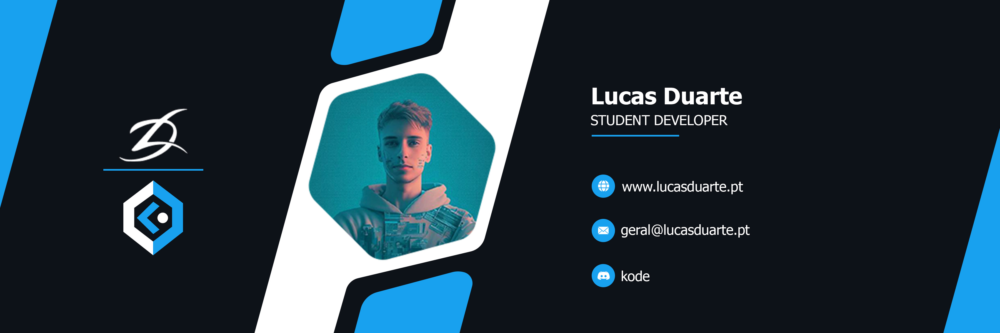
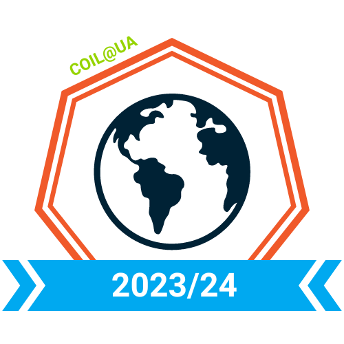

<h1 style="color: #44AEFB;"> 👨🏻‍💻 Lucas Duarte, Developer</h1>

    Sou um jovem com capacidade de iniciativa e com vontade de expandir os meus conhecimentos na área da informática. Estou sempre disposto aceitar novos desafios e ajudar.
 
 

[Email Me](mailto:geral@lucasduarte.pt)

    
 
<!-- Languages and Tools -->

<h2 style="color: #44AEFB">⚙️ Languages and Tools</h2>

     

    
<!-- Icons Resources -->

  
  
  
  
  
      
  
  
  

 
 

<!-- Latest YouTube Videos -->

<h2 style="color: #44AEFB">🎦 Latest YouTube Videos</h2>
 

<!-- BEGIN YOUTUBE-CARDS -->

<!-- END YOUTUBE-CARDS -->

<!-- Begin Youtube Buttons -->

 
<!-- End Youtube Buttons -->

<!-- Statistics -->

<h2 style="color: #44AEFB">📊 Statistics</h2>

<!-- Begin Stats Cards -->
<!-- Resources:  -->
<!-- Change the value after ?username= to your GitHub username. -->

<!--  End Stats Cards -->

---
<!-- Begin Footer -->
<!-- Icons Resources -->

    
    

<!-- End Footer -->
